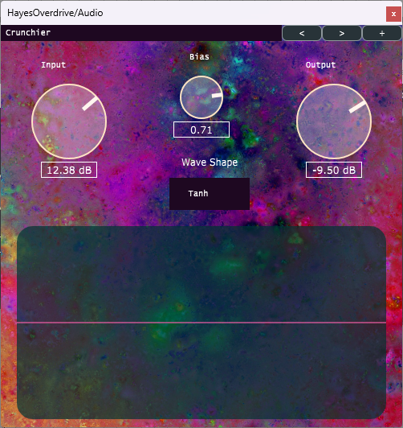

# HayesOverdrive
A simple Overdrive (tanh) plugin utilizing provided constructs within juce::dsp.
Users can interact with input and output from the overdrive, giving them control over the amount of overdrive applied to their signal,
as well as the gain of the final result.

